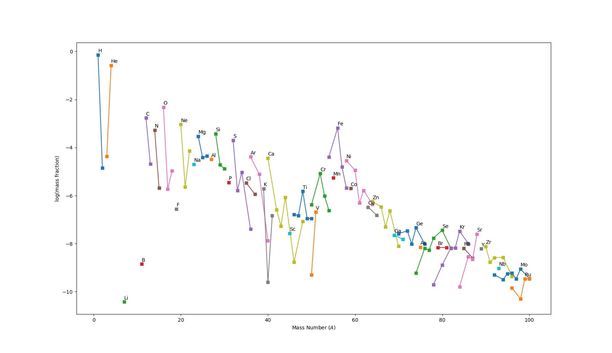

Demonstrations
==============

NuGridPy comes with its own demos. To run them, start your Python session and type in:

.. code-block:: python

   from nugridpy.demos import demo
   demo()

It will print out the different demos available, which we describe in more details in the following sections.

Each of these demos does the following:

* reading stellar data
* outputing some information
* generating plots

For instance, the :code:`nugrid_out` demo will produce a plot of the isotopes abundances:

References
----------

.. automodule:: nugridpy.demos
   :members:
   :special-members:
   :member-order: bysource
