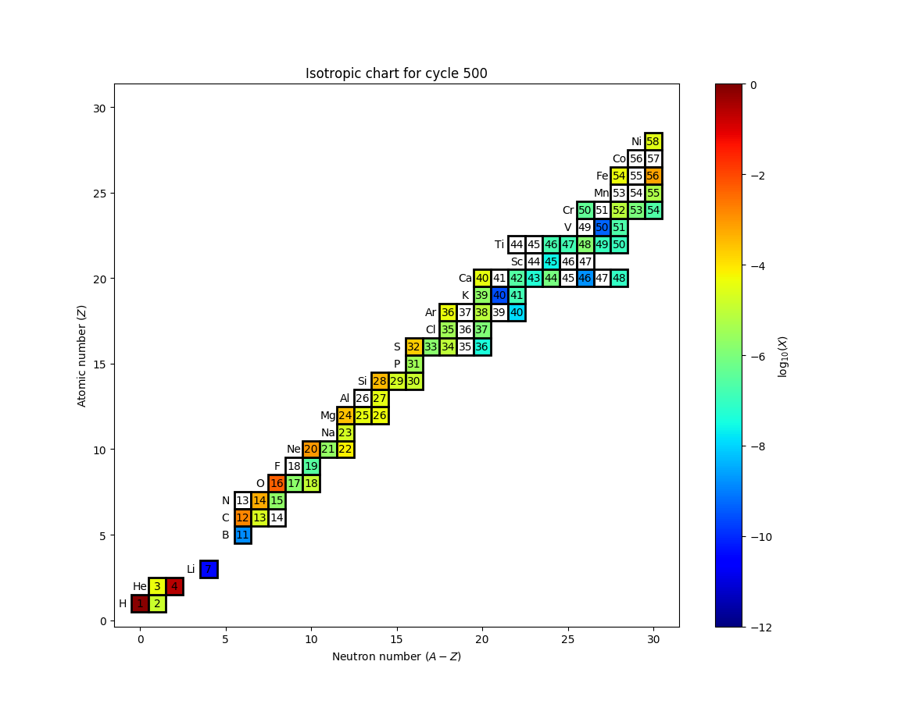
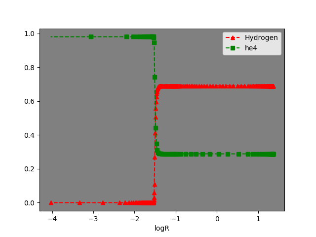

Plotting
========

.. contents::
    :local:
    :depth: 1

Plotting functionalities are implemented inside several mixins that are defined in the :py:mod:`~nugridpy.plot` module.
These mixins are base classes for the different :ref:`data<data>` classes:

* :py:class:`~nugridpy.plot.MesaPlotMixin` for MESA data
* :py:class:`~nugridpy.plot.NugridPlotMixin` for NuGrid data

We explain in this section how to easily produce plots.

Generic plots
-------------

First, we need to load data. We can use the data availabel in the :code:`resources` folder:

.. code:: python

    import os
    import pkg_resources
    from nugridpy import mesa_data, nugrid_data

    path = pkg_resources.resource_filename('nugridpy', os.path.join('resources', 'mesa', 'LOGS'))
    m = mesa_data(path, data_type='text')

Data objects have a generic :py:func:`~nugridpy.plot.PlotMixin.plot` method to visualize headers and data profiles.
The following code

.. code:: python

    # Evolution of some cycle headers
    m.plot('star_age', ['radius', 'log_L'], logy=True)

    # Data profiles for cycles 2030 and 2210
    m.plot('logR', 'logRho', [2030, 2210])

will produce two plots:

|agevsRandL| |logRvslogRho|

.. |agevsRandL| image::  ../images/agevsRandL.png
   :width: 45%
.. |logRvslogRho| image::  ../images/logRvslogRho.png
   :width: 45%

Specific plots
--------------

Hertzsprung-Russel diagramm
***************************

You can produce Hertzsprung-Russel diagramm using the :py:func:`~nugridpy.plot.MesaPlotMixin.hrd` method:

.. code:: python

    # HRD
    m.hrd()

.. figure::  ../images/HRD.png
   :align:   center
   :scale: 60%

T\ :sub:`c`\-Rho\ :sub:`c`\  diagramm
*************************************

The :py:func:`~nugridpy.plot.MesaPlotMixin.tcrhoc` method plots the central density vs. the central temperature:

.. code:: python

    # TcRhoc diagramm
    m.tcrhoc()

.. figure::  ../images/tcrhoc.png
   :align:   center
   :scale: 60%

Kippenhahn diagramm
*******************

One can also make a Kippenhahn diagramm with the :py:func:`~nugridpy.plot.MesaPlotMixin.kippenhahn` method:

.. code:: python

    # kippenhahn diagramm
    m.kippenhahn('star_age', x0=9.4e8, CO_ratio=True)

.. figure::  ../images/kippenhahn.png
   :align:   center
   :scale: 40%

Abundances profiles
*******************

With NuGrid data, one can plot the abundances of some species vs mass coordinates
using the method :py:func:`~nugridpy.plot.NugridPlotMixin.abu_profile`:

.. code:: python

    path2 = pkg_resources.resource_filename('nugridpy', os.path.join('resources', 'nugrid', 'H5_out'))
    n = nugrid_data(path2)

    # Check the available isotopes
    print(n.isotopes)

    # Abundance profiles
    n.abu_profile(500, isos=['H-1', 'He-4', 'C-12', 'C-13', 'N-14', 'O-16'], logy=True)

.. figure::  ../images/abu_profile.png
   :align:   center
   :scale: 60%

Isotopes abundances
*******************

One can plot the different isotopes abundances using the :py:func:`~nugridpy.plot.NugridPlotMixin.iso_abu` method:

.. code:: python

    # Isotope abundances
    n.iso_abu(500, a_max=100)

.. figure::  ../images/iso_abund.png
   :align:   center
   :scale: 40%

Abundances chart
****************

User the :py:func:`~nugridpy.plot.NugridPlotMixin.abu_chart` method to plot an abundance chart:

.. code:: python

    # Abundances chart
    n.abu_chart(500, n_max=30, z_max=30)

Plot customization
------------------

Plotting is performed using the well-known `Matplotlib <https://matplotlib.org/>`_ package.
It provides a thorough and complex API allowing plot modifications.
In order to keep the NuGridPy API simple, it is impossible for the user to interface directly with the
`Matplotlib <https://matplotlib.org/>`_ API using the different plotting functions.

However, each of these functions returns a :code:`Matplotlib Figure` which can be interacted with.
For instance:

.. code:: python

    fig = m.plot('logR', ['h1', 'he4'], cycles=2030)
    ax = fig.gca()

    # Change linestyles
    ax.lines[0].set_linestyle('--')
    ax.lines[0].set_color('r')
    ax.lines[0].set_label('Hydrogen')

    # Regenerate legend
    ax.legend()

    # Change baackground
    ax.set_facecolor('grey')

    # Update plot
    fig.canvas.draw()

will produce the following plot:

References
----------

.. automodule:: nugridpy.plot
   :members:
   :member-order: bysource
   :exclude-members: __weakref__
